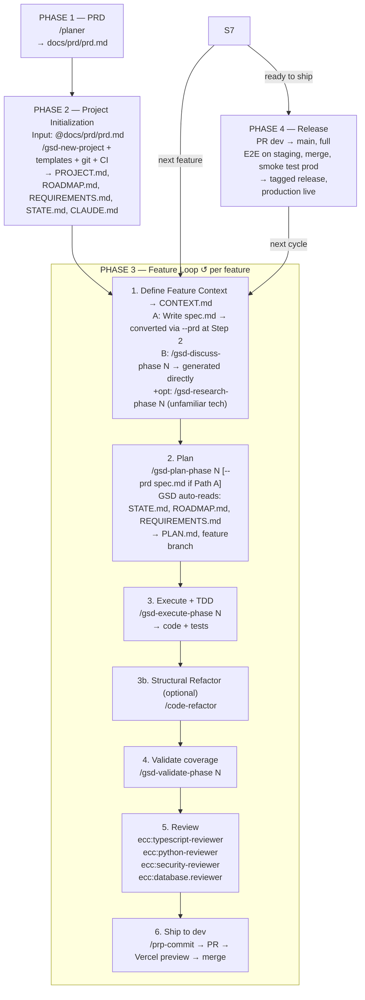

# 🐶 Doggies: Development Workflow

**Philosophy:** Ship fast, stay honest. TDD for real tests, CI for safety net, one reviewer pass per feature. Three document layers (product → project → feature) instead of eight-plus per-phase artifacts.

---

## Integrations

| Tool                    | Scope   | Role                                                          |
| ----------------------- | ------- | ------------------------------------------------------------- |
| **GSD v1.36.0**   | project | Planning, execution, verification                             |
| **startup-skill** | project | Idea validation (future projects with fuzzy vision)           |
| **ECC**           | global  | Code review (TypeScript, security, database)                  |
| **agent-skills**  | global  | Engineering workflow skills (TDD, code review)                |
| **Templates**     | project | Agents + rules from `claude_setup_ai_mock_interviewer_app/` |
| **GitHub**        | CI/CD   | PR workflow, Actions for type-check + lint + tests            |
| **Vercel**        | CI/CD   | Auto-deploy `dev`to staging,`main`to production           |
| **ECC Memory**    | global  | Cross-session continuity via `ecc:save-session`             |

---

## Workflow Overview



---

## PHASE 1 — PRD *(once per project)*

**Purpose:** Define what the product is at a level that won't churn weekly. The PRD answers "what and why"; it's a reference, not a contract.

**Command:** (custom command at project-level)

```
/planner
```

**Input:** your vision

Write `docs/prd/prd.md` with:

* Problem & users
* Core value (one sentence)
* Core flows (the 3–5 things users do)
* Data model (entities + relationships, not schemas)
* Non-goals (what the product is  *not* )
* Open questions

**Output:** `docs/prd/prd.md`

**Living doc rule:** PRD can change, but meaningful changes get logged in PROJECT.md's Key Decisions table (created in Phase 2). When the PRD changes, ask: *does this invalidate shipped features?* If yes, either remove/migrate the feature or the PRD change is wrong.

---

## PHASE 2 — Project Initialization *(once per project)*

**Purpose:** Scaffold the project — GSD planning files, template agents/rules, git branches, CI, deploys. Everything here is one-time setup.

### 2a. Template Integration

**Purpose:** Drop in the agents and rules you've battle-tested in prior projects.

**Commands:**

```bash
# Agents (git-commit excluded — GSD ships /prp-commit which covers this)
cp claude_setup_ai_mock_interviewer_app/agents/planner.md .claude/agents/
cp claude_setup_ai_mock_interviewer_app/agents/verification-agent.md .claude/agents/
cp claude_setup_ai_mock_interviewer_app/agents/code-refactor.md .claude/agents/

# Rules (adapt to stack — replace Supabase/Next.js refs if stack differs)
cp claude_setup_ai_mock_interviewer_app/rules/api-routes.md .claude/rules/
cp claude_setup_ai_mock_interviewer_app/rules/auth.md .claude/rules/
cp claude_setup_ai_mock_interviewer_app/rules/components.md .claude/rules/
cp claude_setup_ai_mock_interviewer_app/rules/pages.md .claude/rules/
cp claude_setup_ai_mock_interviewer_app/rules/supabase.md .claude/rules/

# Security checklist
mkdir -p .claude/skills/backend-security/references/
cp claude_setup_ai_mock_interviewer_app/skills/.../security-checklist.md .claude/skills/backend-security/references/
```

**Input:** template repo
**Output:** `.claude/agents/*`, `.claude/rules/*`, `.claude/skills/backend-security/references/security-checklist.md`

### 2b. GSD Project Setup

**Purpose:** Generate the project's planning substrate — what GSD needs to drive the dev loop.

**Command:**

```
/gsd-new-project
```

When prompted "What do you want to build?", reply with:

```
@docs/prd/prd.md
```

**Input:** `docs/prd/prd.md` (via `@` reference)
**Output:** `.planning/PROJECT.md`, `.planning/REQUIREMENTS.md`, `.planning/ROADMAP.md`, `.planning/STATE.md`, `.planning/research/*`, `CLAUDE.md`

**What each file contains:**

- `PROJECT.md`
  - Content: Mission, current status, key decisions, team
  - Read by: You, at session start
- `REQUIREMENTS.md`
  - Content: **Global** project requirements with category IDs (`AUTH-01`, `PROF-02`, etc.), full v1 scope + deferred v2 + out-of-scope. Per-feature assignment lives in ROADMAP.md's `Requirements:` field — not here.
  - Read by: GSD planner automatically
- `ROADMAP.md`
  - Content: Phased plan; each phase lists its assigned REQ-IDs and success criteria
  - Read by: GSD planner automatically
- `STATE.md`
  - Content: Current phase, last action, resume point — injected at every session start via hook
  - Read by: GSD at session start
- `research/*`
  - Content: Findings from parallel researchers (stack, architecture, pitfalls)
  - Read by: GSD planner automatically
- `CLAUDE.md`
  - Content: Project contract: stack, env vars, invariants — auto-loaded by Claude Code on every session
  - Read by: Always in context

**Post-generation:** add to `CLAUDE.md` the app's build philosophy and TDD forcing line:

* Preference: OSS → free SaaS → paid SaaS → custom
* TDD mandatory: *"If about to write code without a failing test first, stop and write the test."*

### 2c. Git Branch Structure

**Purpose:** Two-environment deploy model — `dev` is staging, `main` is production.

**Commands:**

```bash
git checkout -b dev main
git push -u origin dev
```

**Branches:**

* `main` — production, protected, tagged releases
* `dev` — integration + staging deploy (auto-deploys to Vercel staging)
* `feature/*` — per-feature, created from `dev`, merged back to `dev`

**Output:** two long-lived branches

### 2d. CI + Vercel Setup

**Purpose:** Automated safety net. CI runs tests so you don't have to remember to.

**GitHub Actions** — create `.github/workflows/ci.yml`:

* On PR to `dev`: type-check, lint, unit + integration tests
* On PR to `main`: all of the above + E2E against Vercel staging URL
* Block merge on red

**Vercel:**

* Connect repo
* Set `dev` branch → staging environment
* Set `main` branch → production environment
* Preview deployments auto-generated for every PR

**Input:** GitHub repo, Vercel account
**Output:** `.github/workflows/ci.yml`, Vercel project configured

### 2e. Memory Path Fix

**Purpose:** Pin ECC memory to a stable location instead of the fragile npx cache path.

**Two approaches — pick one:**

**Option A — Per-project isolation (recommended):** each project has its own memory graph. Clean slate per project, no cross-contamination. Add to `settings.local.json`:

```json
{ "MEMORY_FILE_PATH": "/Users/guirau/GitHub/guirau/Experiments/Doggies/.claude/memory.jsonl" }
```

**Option B — Global shared memory:** all projects write to the same graph. Cross-project knowledge accumulates. Add to `~/.claude/settings.json` instead:

```json
{ "MEMORY_FILE_PATH": "/Users/guirau/.claude/memory.jsonl" }
```

Either way, `ecc:save-session` (run at session end) is what actually writes to the file — it does not save automatically.

**Output:** stable memory location across sessions

---

## PHASE 3 — Feature Development Loop *(repeat per feature)*

**Purpose:** Build each feature with consistent discipline — write spec, plan, execute with TDD, validate, review, ship to dev.

### Step 1 — Define Feature Context

**Purpose:** Give GSD the context it needs to generate a focused PLAN.md. Two paths depending on how clearly the feature is understood.

---

**Path A — Write spec.md** *(recommended for most features)*

Create `docs/features/<feature-name>/spec.md` with:

* **Must happen** — positive requirements (maps to positive tests)
* **Mustn't happen** — negative requirements, guards, forbidden states (maps to negative tests)
* **Nice to have** — backlog, don't test, don't block shipping

You pass this to `/gsd-plan-phase` via `--prd` at Step 2. GSD reads it, treats every item as a locked decision, generates a CONTEXT.md from it, and proceeds to planning. No interactive prompts.

---

**Path B — Interactive context generation**

```
/gsd-discuss-phase N
```

GSD runs a Socratic Q&A loop to surface requirements and lock decisions. Produces `.planning/phases/N-*/XX-CONTEXT.md` directly — no spec.md needed. Use when the feature is fuzzy and you'd rather think it through conversationally.

---

**Optional enhancers (either path):**

```
/gsd-spec-phase N        ← Socratic Q&A to sharpen scope and surface edge cases
/gsd-research-phase N    ← Research unfamiliar tech, libraries, approaches
```

**Output:** `.planning/phases/N-*/XX-CONTEXT.md` — the locked decision set GSD uses to generate PLAN.md. In Path A, CONTEXT.md is generated from spec.md at Step 2 via `--prd`; in Path B, it's generated here directly. Either way, CONTEXT.md is what GSD plans from.

### Step 2 — Plan

**Purpose:** Break the feature into granular tasks with a self-contained plan the executor can follow in a fresh session.

**Commands:**

```bash
git checkout -b feature/<feature-name> dev
```

**Path A** (spec.md from Step 1):

```
/gsd-plan-phase N --prd docs/features/<feature-name>/spec.md
```

**Path B** (CONTEXT.md from `/gsd-discuss-phase`):

```
/gsd-plan-phase N
```

GSD picks up CONTEXT.md automatically — no flag needed.

In both cases GSD automatically reads `.planning/STATE.md`, `.planning/ROADMAP.md`, `.planning/REQUIREMENTS.md`, and any `{N}-RESEARCH.md` from Step 1.

**Output:** `PLAN.md` with task breakdown, feature branch created

### Step 3 — Execute with TDD

**Purpose:** Build the feature. Tests first, code second. Security-aware from the start.

**Command:**

```
/gsd-execute-phase N
```

Per task, the loop is:

1. Write failing test (RED)
2. Implement minimally to pass (GREEN)
3. Refactor (IMPROVE)

**Run tests locally in watch mode while you work** — keep a terminal tab open with `npm test -- --watch` or your stack's equivalent. This is your primary feedback loop.

For auth, payment, or external API code: consult `.claude/skills/backend-security/references/security-checklist.md`  *inline during execution* , not as a separate step.

**Your job during execution:** don't blindly trust generated tests. When a test file appears, skim it: *does it test the behavior from my SPEC, or just that the function runs?* Push back on tests that don't match your must/mustn't lines.

**Input:** PLAN.md, SPEC.md
**Output:** working code + tests, `SUMMARY.md`, `VERIFICATION.md`

### Step 3b — Structural Refactor *(optional)*

**Purpose:** Whole-feature cleanup pass after execution. The GSD executor refactors per-task during the IMPROVE step — this step catches structural issues that only become visible once all tasks are complete: long functions across the full diff, confusing names, logic duplicated across tasks, loose types.

**When to use:** after Step 4, skim the diff. If you see structural problems worth cleaning before review, run this. If the code already looks tight, skip it.

**How to invoke:**

Tell Claude: `"Run the code-refactor agent"` — same sub-agent mechanism as the planner. Lives in `.claude/agents/code-refactor.md`, spawned via the Agent tool.

The agent:

- Renames confusing identifiers, flattens nested conditionals, splits long functions
- Extracts shared logic only when it appears 3+ times
- Tightens loose `any`/`unknown` types — never widens
- Removes dead code (unused imports, unreachable branches)
- Runs `npm run build` → `npm run lint` → tests after each batch — stops if anything breaks
- Stops and reports if more than 5 files need touching (run in batches by area for large features)

**Hard rule:** no behavior changes, no bug fixes, no new features in a refactor pass. If a bug is spotted mid-refactor, note it and stop.

**Input:** executed code + passing tests
**Output:** same behavior, cleaner structure

### Step 4 — Validate Coverage

**Purpose:** Audit layer for missing test cases. TDD gives you tests-before-code, not thorough tests. This step catches gaps.

**Command:**

```
/gsd-validate-phase N
```

If gaps found: generates missing tests and re-runs until coverage is acceptable.

**Input:** executed code + tests
**Output:** coverage report, gap-filling tests, `{N}-UAT.md`

### Step 5 — Review

**Purpose:** One reviewer pass before PR. Manual invocation — you choose which reviewer(s) matter for this feature.

**Commands (pick what applies):**

| Changed                                | Reviewer                             |
| -------------------------------------- | ------------------------------------ |
| Any TS/JS code                         | `ecc:typescript-reviewer`— always |
| Auth, sessions, tokens, user data      | +`ecc:security-reviewer`           |
| Payment flows, API keys, webhooks      | +`ecc:security-reviewer`           |
| External API calls                     | +`ecc:security-reviewer`           |
| DB schema, migrations, complex queries | +`ecc:database-reviewer`           |
| Trivial (copy fix, config tweak)       | skip review                          |

**Action:** fix all CRITICAL findings. Consider HIGH findings. Note MEDIUM/LOW.

**Input:** the diff
**Output:** review findings, fixes applied

### Step 6 — Ship to Dev

**Purpose:** Merge the feature to `dev` (staging). CI and Vercel handle the rest.

**Commands:**

```
/prp-commit
```

(GSD's built-in commit command — intelligent staging + conventional commit message.)

```bash
gh pr create --base dev --head feature/<feature-name>
```

* GitHub Actions runs: type-check + lint + tests
* Vercel generates preview URL for visual check
* Merge to `dev` on green

```
ecc:save-session
```

(Persist session memory.)

**Input:** feature branch with all checks passing locally
**Output:** merged feature, Vercel preview URL, session memory saved

### Step 7 — Archive SPEC *(when feature is confirmed stable)*

**Purpose:** Keep `docs/features/` as a clean view of *active* work.

**Command:**

```bash
mv docs/features/<feature-name> docs/features/_shipped/
```

**Output:** archived SPEC, historical record preserved

---

## PHASE 4 — Release *(dev → main)*

**Purpose:** Ship accumulated features in `dev` to production, with full E2E safety check.

**Commands:**

```bash
gh pr create --base main --head dev
```

* GitHub Actions runs full suite including E2E against `dev`'s Vercel staging URL
* If red: fix on a feature branch, re-merge to `dev`, re-test
* If green: merge to `main`

```bash
git tag v<version>
git push origin v<version>
```

* Vercel auto-deploys `main` to production
* Smoke test the production URL (critical paths manually)

**Input:** green `dev` branch
**Output:** tagged release, live production deployment

---

## Evolving the Roadmap

### Adding features mid-milestone

| Situation                                              | Command                                     | Effect                                                              |
| ------------------------------------------------------ | ------------------------------------------- | ------------------------------------------------------------------- |
| New feature, add to end of current work                | `/gsd-add-phase <description>`            | New integer phase appended to active milestone                      |
| Urgent feature that must go*between* existing phases | `/gsd-insert-phase <after> <description>` | Inserted as decimal (e.g.,`3.1`) — no renumbering                |
| Idea not ready to commit to yet                        | `/gsd-add-backlog <description>`          | Parked as `999.x` — outside active sequence, accumulates context |

### Promoting backlog ideas

When ready to act on captured ideas:

```
/gsd-review-backlog
```

Shows all `999.x` items with their accumulated artifacts. Per item: **Promote** (moves to next integer phase in active milestone), **Keep**, or **Remove**. You can also run `/gsd-discuss-phase 999.x` on a backlog item to flesh it out before promoting.

### Starting a new batch of features (after milestone is complete)

```
/gsd-new-milestone <name>
```

The brownfield equivalent of `/gsd-new-project`. Project history and all prior phases are preserved. Runs: questioning → optional research → scoped `REQUIREMENTS.md` for the new milestone → `ROADMAP.md` updated (numbering continues from where you left off) → `STATE.md` reset. After this, resume the normal Phase 3 loop.

**Recommended habit:** capture every feature idea as `/gsd-add-backlog` the moment it comes up. At milestone end, `/gsd-review-backlog` to triage, then `/gsd-new-milestone` to plan the next cycle.

---

## Continuous Practices

| Practice          | When                                                  | Tool / Action                                                                           |
| ----------------- | ----------------------------------------------------- | --------------------------------------------------------------------------------------- |
| Tests in watch    | While coding (every feature)                          | `npm test -- --watch`(or equiv)                                                       |
| Session memory    | End of every session                                  | `ecc:save-session`                                                                    |
| STATE.md update   | End of every session                                  | Update `.planning/STATE.md`manually                                                   |
| PROJECT.md update | When a decision changes                               | Update Key Decisions table                                                              |
| PRD update        | When product vision shifts (rare)                     | Edit `docs/prd/prd.md`+ log change                                                    |
| Progress checks   | Any time                                              | `/gsd-progress`,`/gsd-check-todos`                                                  |
| Dead code cleanup | End of milestone (or when the codebase feels bloated) | `refactor-clean` skill — runs knip/depcheck/ts-prune, deletes with test verification |

---

## Essential Documents

**Product layer** (written once, updated rarely):

* `docs/prd/prd.md`

**Project layer** (generated by GSD, some update often):

* `.planning/PROJECT.md` — operational dashboard (re-read often)
* `.planning/ROADMAP.md` — what's next
* `.planning/REQUIREMENTS.md` — traceability
* `.planning/STATE.md` — session resume point
* `.planning/research/*` — background research
* `CLAUDE.md` — Claude Code operating contract

**Feature layer** (one per feature, disposable):

* `docs/features/<name>/spec.md` — active features
* `docs/features/_shipped/<name>/` — shipped features

**Scaffolding** (static):

* `.claude/agents/*`, `.claude/rules/*`
* `.claude/skills/backend-security/references/security-checklist.md`
* `.github/workflows/ci.yml`

---

## Command Summary

**Once per project:**

```
/startup:startup-design    (optional, fuzzy vision only)

# Phase 1 — PRD (tell Claude, not a slash command):
# "Run the planner agent"

# Phase 2 — Project init:
/gsd-new-project
```

**Per feature:**

```
# Step 1 — Define context (pick one path):
/gsd-discuss-phase N                              (Path B: interactive)
# OR: write docs/features/<name>/spec.md manually (Path A: written)

# Optional enhancers (either path):
/gsd-spec-phase N          (sharpen scope)
/gsd-research-phase N      (unfamiliar tech)

# Step 2 — Plan:
/gsd-plan-phase N --prd docs/features/<name>/spec.md   (Path A)
/gsd-plan-phase N                                       (Path B)

# Steps 3–6:
/gsd-execute-phase N
# "Run the code-refactor agent"  (optional, Step 3b — tell Claude, not a slash command)
/gsd-validate-phase N
ecc:typescript-reviewer    (+ others as needed)
/prp-commit
```

**End of session:**

```
ecc:save-session
```

**Release:**

```
gh pr create --base main --head dev
git tag v<version>
```

**Roadmap evolution:**

```
/gsd-add-backlog <description>     # park an idea anytime (999.x)
/gsd-add-phase <description>       # add feature to end of current milestone
/gsd-insert-phase <after> <desc>   # urgent: insert between existing phases (decimal)
/gsd-review-backlog                # triage 999.x items → promote / keep / remove
/gsd-new-milestone <name>          # start next batch after milestone complete
```

---

## Verification

The workflow is verified by running through it once end-to-end:

* Phase 1: `docs/prd/prd.md` exists with the six sections
* Phase 2: `.planning/` populated by GSD; template agents/rules in place; CI + Vercel configured; branches `main` and `dev` exist
* Phase 3 per feature: SPEC exists with must/mustn't/nice-to-have; tests written before code; coverage validated; reviewer pass completed; PR merged to `dev` on green CI
* Phase 4: E2E green on staging; `main` tagged; production URL live
