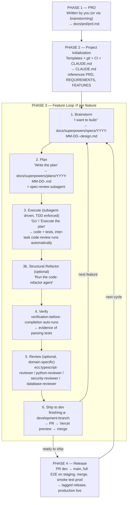

# 🐶 Doggies: Development Workflow (Superpowers Edition)

**Philosophy:** Ship fast, stay honest. TDD enforced at the skill level, subagent-driven execution with inter-task review, CI as the safety net. Three document layers (product → project → feature) — the feature layer is now generated by Superpowers skills instead of GSD phases.

**Key shift from v1 (GSD):** Most steps are no longer slash commands. Superpowers skills auto-trigger from natural-language intent, so the workflow describes what you *say* to Claude more than what you  *type as a command* . The old `/gsd-*` commands are replaced by the `brainstorming` → `writing-plans` → `subagent-driven-development` → `verification-before-completion` → `finishing-a-development-branch` skill chain, which fires automatically when Claude detects you're starting feature work.

---

## Integrations

| Tool                      | Scope   | Role                                                               |
| ------------------------- | ------- | ------------------------------------------------------------------ |
| **Superpowers v5+** | project | Brainstorming, planning, TDD execution, code review, branch finish |
| **ECC**             | global  | Code review (TypeScript, Python, security, database)               |
| **Templates**       | project | Agents + rules from `claude_setup_ai_mock_interviewer_app/`      |
| **GitHub**          | CI/CD   | PR workflow, Actions for type-check + lint + tests                 |
| **Vercel**          | CI/CD   | Auto-deploy `dev`to staging,`main`to production                |
| **ECC Memory**      | global  | Cross-session continuity via `ecc:save-session`                  |

Superpowers replaces: GSD, the startup-skill, and most of `agent-skills` (TDD and code review are built into Superpowers).

---

## Workflow Overview



---

## PHASE 1 — PRD *(once per project)*

**Purpose:** Define what the product is at a level that won't churn weekly. The PRD answers "what and why"; it's a reference, not a contract.

**How to create it:** two options.

**Option A (recommended for Doggies):** write it yourself. PRDs are short, you have the product vision, and the Socratic back-and-forth is overkill for something this size. Put it at `docs/prd/prd.md`.

**Option B (best automated option): invoke the Planner agent.** Say:

> *"Run the planner agent."*

The `planner` agent from `.claude/agents/planner.md` runs a structured Socratic discovery loop using `AskUserQuestion` — it won't stop asking until *you* say you're satisfied. It then generates a comprehensive, agent-optimized PRD at `docs/prd/prd.md` with:

* Structured user stories with hard-threshold acceptance criteria
* Data model and API endpoint specs
* UI/UX screen map with loading/empty/error states
* Sprint contracts (each task has an explicit "done" condition)
* Evaluation criteria (what an evaluator agent would grade against)
* Open questions

This is the right option when the product vision is still forming or when you want a PRD an AI coding agent can consume without ambiguity. The output is considerably more detailed than what Superpowers brainstorming produces.

**Option C:** invoke Superpowers' brainstorming skill for a lighter-touch project-level topic. Say:

> *"I want to brainstorm the PRD for Doggies."*

The `brainstorming` skill asks one question at a time, proposes options, and writes the output to `docs/superpowers/specs/YYYY-MM-DD-doggies-prd-design.md`. Move that to `docs/prd/prd.md` after review. Less structured than Option B, but faster for a product you already understand well.

Either way, the PRD should contain at minimum:

* Problem & users
* Core value (one sentence)
* Core flows (the 3–5 things users do)
* Data model (entities + relationships, not schemas)
* Non-goals (what the product is  *not* )
* Open questions

**Output:** `docs/prd/prd.md`

**Living doc rule:** PRD can change. Log meaningful changes somewhere visible — either in the PRD itself (changelog section) or in a `DECISIONS.md` at the repo root. When the PRD changes, ask: *does this invalidate shipped features?* If yes, either remove/migrate the feature or the PRD change is wrong.

---

## PHASE 2 — Project Initialization *(once per project)*

**Purpose:** Scaffold the project — template agents/rules, git branches, CI, deploys, and the CLAUDE.md that wires Superpowers to your project context. Everything here is one-time setup.

### 2a. Install Superpowers

```
/plugin marketplace add obra/superpowers-marketplace
/plugin install superpowers@superpowers-marketplace
```

Quit and restart Claude Code. Verify with `/help` — you should see Superpowers skills listed (though most of them auto-trigger, so you won't invoke them directly).

### 2b. Template Integration

**Purpose:** Drop in the agents and rules you've battle-tested in prior projects.

* **`code-refactor`** — keep. Handles whole-feature structural cleanup after execution; Superpowers' inter-task review doesn't do this.
* **`planner`** — keep. A Socratic PRD generation agent (Phase 1, once per project). It's *not* the same as Superpowers' `writing-plans` — that skill produces feature-level TDD execution plans, while `planner` produces a project-level PRD with evaluation criteria and sprint contracts. Different scope entirely.
* **`verification-agent`** — skip. Its flows are hardcoded to the AI mock interviewer app (interview setup, streaming, dark-theme checks). Those flows don't exist in Doggies. If you later want Playwright-based UI verification for Doggies, copy the agent and rewrite the "Flows to verify" section for your actual screens (login → dog list → dog detail).

```bash
# Agents (verification-agent excluded — app-specific flows for the mock interviewer)
cp claude_setup_ai_mock_interviewer_app/agents/code-refactor.md .claude/agents/
cp claude_setup_ai_mock_interviewer_app/agents/planner.md .claude/agents/

# Rules (adapt to stack)
cp claude_setup_ai_mock_interviewer_app/rules/api-routes.md .claude/rules/
cp claude_setup_ai_mock_interviewer_app/rules/auth.md .claude/rules/
cp claude_setup_ai_mock_interviewer_app/rules/components.md .claude/rules/
cp claude_setup_ai_mock_interviewer_app/rules/pages.md .claude/rules/
cp claude_setup_ai_mock_interviewer_app/rules/supabase.md .claude/rules/

# Security checklist
mkdir -p .claude/skills/backend-security/references/
cp claude_setup_ai_mock_interviewer_app/skills/.../security-checklist.md .claude/skills/backend-security/references/
```

**Output:** `.claude/agents/code-refactor.md`, `.claude/rules/*`, `.claude/skills/backend-security/references/security-checklist.md`

### 2c. Write CLAUDE.md

**Purpose:** This is the project contract. Superpowers v5+ explicitly instructs agents to prefer your CLAUDE.md over its own internal instructions. Everything that was split across `PROJECT.md`, `REQUIREMENTS.md`, `ROADMAP.md`, and `STATE.md` in GSD collapses into CLAUDE.md + a couple of optional sidecar files here.

There is  **no `/gsd-new-project` equivalent** . Superpowers doesn't generate project scaffolding for you — you write CLAUDE.md by hand. This is an honest loss vs. GSD's auto-generation. The upside is that everything in your CLAUDE.md is deliberate.

Create `CLAUDE.md` at the repo root with these sections:

* **Mission + current status** — one paragraph each. (Replaces GSD's PROJECT.md.)
* **Stack + env vars + invariants** — the operating contract.
* **Build philosophy** — your Doggies-specific directives:
  * Preference order: OSS → free SaaS → paid SaaS → custom
  * Propose 2–3 options per feature; flag SaaS replacements (payments → Stripe, chat → Discord, etc.)
  * Custom is last resort and must be justified
* **TDD directive** — *"If about to write code without a failing test first, stop and write the test."* (Superpowers' `test-driven-development` skill enforces this anyway, but the redundancy is cheap.)
* **Reading order at session start** — tell Claude to read `docs/prd/prd.md`, `REQUIREMENTS.md`, and `FEATURES.md` before starting any brainstorm.

Optional sidecars (create only if you need them):

* **`REQUIREMENTS.md`** — REQ-IDs (`AUTH-01`, `PROF-02`), v1 scope + deferred v2 + out-of-scope. Superpowers doesn't auto-read this; CLAUDE.md must tell it to. Add this line to CLAUDE.md: *"Before brainstorming any feature, identify which REQ-IDs from REQUIREMENTS.md this feature satisfies. The spec doc must list them under a `Satisfies:` header."*
* **`FEATURES.md`** — flat list of features with status (`not-started` / `spec'd` / `planned` / `executing` / `shipped`) and assigned REQ-IDs. Replaces GSD's ROADMAP.md. Update manually after each feature ships.

**What you're NOT creating:**

* `STATE.md` — Superpowers has no state-injection hook. The plan file's checkboxes are the state-across-sessions mechanism (unchecked boxes tell the next session where to resume). Good enough for a solo project.
* `.planning/research/*` — no auto-read equivalent. If you need research for a feature, either reference it manually during brainstorming (`"read docs/research/pgvector.md before we design this"`) or write a tiny custom skill that auto-loads a research directory. For Doggies the stack is known, so this is unlikely to matter.

### 2d. Git Branch Structure

**Purpose:** Two-environment deploy model — `dev` is staging, `main` is production. Unchanged from v1.

```bash
git checkout -b dev main
git push -u origin dev
```

**Branches:**

* `main` — production, protected, tagged releases
* `dev` — integration + staging deploy (auto-deploys to Vercel staging)
* `feature/*` — per-feature, created from `dev`, merged back to `dev`

Superpowers' `finishing-a-development-branch` skill integrates with this model — it handles PR creation and worktree cleanup when you're done with a feature.

### 2e. CI + Vercel Setup

**Purpose:** Automated safety net. Unchanged from v1 — Superpowers generates standard code + tests, works with any CI.

**GitHub Actions** — create `.github/workflows/ci.yml`:

* On PR to `dev`: type-check, lint, unit + integration tests
* On PR to `main`: all of the above + E2E against Vercel staging URL
* Block merge on red

**Vercel:**

* Connect repo
* Set `dev` branch → staging environment
* Set `main` branch → production environment
* Preview deployments auto-generated for every PR

**Output:** `.github/workflows/ci.yml`, Vercel project configured

### 2f. Memory Path Fix (ECC)

Unchanged from v1. Pin ECC memory to a stable location.

**Option A — Per-project (recommended):**

```json
{ "MEMORY_FILE_PATH": "/Users/guirau/GitHub/guirau/Experiments/Doggies/.claude/memory.jsonl" }
```

in `settings.local.json`.

**Option B — Global shared memory:**

```json
{ "MEMORY_FILE_PATH": "/Users/guirau/.claude/memory.jsonl" }
```

in `~/.claude/settings.json`.

`ecc:save-session` (at session end) is what actually writes. Superpowers itself has no memory system in the core plugin — if you want cross-session recall of past conversations, there's a separate `episodic-memory` plugin from the same author. Don't install it yet; start with ECC-only and see if you miss anything.

---

## PHASE 3 — Feature Development Loop *(repeat per feature)*

**Purpose:** Build each feature with consistent discipline — brainstorm a spec, generate a TDD plan, execute via subagents with inter-task review, verify, ship to dev.

**Big shift from v1:** no phase numbers. Superpowers scopes work per  *feature* , not per numbered phase. Each feature gets its own brainstorm → plan → execute → verify → finish cycle, scoped to one PR.

### Step 1 — Brainstorm the feature

**Purpose:** Produce a design spec Superpowers can plan from.

**How to trigger:** just describe the feature in natural language.

> *"I want to build the visit-booking feature — adopters pick a time slot from available Google Calendar windows and the bot confirms with the shelter."*

The `using-superpowers` meta-skill detects feature intent and auto-triggers the `brainstorming` skill. It will:

1. Explore project context (reads CLAUDE.md, and anything CLAUDE.md tells it to read).
2. Ask clarifying questions one at a time, multiple-choice where possible.
3. Propose 2–3 approaches (your build-philosophy directive in CLAUDE.md reinforces this — OSS → free SaaS → paid SaaS → custom).
4. Present the design in sections for your approval.
5. Write the spec to `docs/superpowers/specs/YYYY-MM-DD-<feature>-design.md`.
6. Run a spec-review subagent to catch `TBD`s, contradictions, ambiguity.
7. Ask you to review the file.

**No separate `/gsd-discuss-phase` / `/gsd-spec-phase` / `/gsd-research-phase` distinction.** All three collapse into one brainstorming conversation. If you need to reference unfamiliar tech, tell Claude mid-brainstorm: *"Before we continue, search the Supabase pgvector docs and come back with the three main gotchas."* The brainstorming skill is fine with this.

**No separate "Path A — write spec.md manually" path.** If you've already written a detailed spec, just paste it into the conversation or say *"read docs/features/visit-booking-spec.md and use that as the starting point."* The brainstorming skill will refine it rather than ignore it.

**Output:** `docs/superpowers/specs/YYYY-MM-DD-<feature>-design.md` with sections for goal, architecture, tech stack, requirements (functional + non-functional), data model, API, non-goals, and (because your CLAUDE.md asks for it) a `Satisfies:` header listing REQ-IDs.

### Step 2 — Plan

**Purpose:** Break the feature into granular TDD tasks with a self-contained plan subagents can execute.

**How to trigger:** after approving the spec, say:

> *"Write the plan."*

The `writing-plans` skill takes over. It will:

1. Produce `docs/superpowers/plans/YYYY-MM-DD-<feature>.md` with each task broken into 2–5 minute steps.
2. Enforce the TDD structure — every task has  *Step 1: write the failing test* ,  *Step 2: verify it fails* ,  *Step 3: write minimal implementation* , etc. No implementation step without a preceding test step.
3. Include a "File Structure" section (v5+) deciding which files exist and what each owns.
4. Run a spec-review subagent one more time against the plan itself, checking for placeholders, type inconsistencies, missing spec coverage.

**Feature branch:** Superpowers prefers git worktrees per feature (the brainstorming skill may offer to create one). If you'd rather stay in a traditional feature branch:

```bash
git checkout -b feature/<feature-name> dev
```

**Your job:** skim the plan before executing. Check that every acceptance criterion from the spec has ≥1 test, API routes have integration tests, and the critical flows (adoption / donation / shelter onboarding / visit booking) have e2e tests. If something's missing, tell Claude to revise. Don't execute a half-baked plan.

**Output:** `docs/superpowers/plans/YYYY-MM-DD-<feature>.md`, feature branch (or worktree).

### Step 3 — Execute with TDD

**Purpose:** Build the feature. Tests first, code second. Subagent-driven so each task gets a fresh context.

**How to trigger:**

> *"Go."* *(or "Execute the plan.")*

`subagent-driven-development` auto-triggers (on Claude Code and Codex — platforms with subagent support). For each task:

1. A fresh subagent is dispatched with only the context it needs.
2. It writes the failing test (RED), verifies it fails, writes minimal code (GREEN), verifies it passes, refactors (IMPROVE), commits.
3. Between tasks, `requesting-code-review` runs automatically. Critical issues block progress until fixed — this replaces your old "Step 5 — Review" manual pass *for plan-level concerns* (your domain-specific ECC reviewers still run separately, see Step 5).
4. The `test-driven-development` skill enforces red-green-refactor. If Claude tries to write code before a test, it deletes the code and starts over. This replaces your TDD forcing line as the enforcement mechanism — keep the CLAUDE.md line anyway as belt-and-suspenders.

**Run tests locally in watch mode:** keep a terminal tab open with `npm test -- --watch`. Subagents run their own tests, but your watch mode catches things the minute they happen.

**Security checklist:** for auth, payment, or external API code, the executor subagent should consult `.claude/skills/backend-security/references/security-checklist.md` inline. Make sure CLAUDE.md has a line pointing to it: *"For auth/payment/external-API code, consult `.claude/skills/backend-security/references/security-checklist.md` during execution, not as a separate step."*

**Your job during execution:** you can largely step away for 30–120 minutes, but check the inter-task code review output. If a critical finding blocks progress and the proposed fix looks wrong to you, intervene.

**Output:** working code + tests, commits on the feature branch, per-task code review trail.

### Step 3b — Structural Refactor *(optional)*

**Purpose:** Whole-feature cleanup pass after execution. The subagent executor refactors per-task — this catches structural issues only visible across the full diff.

**When to use:** after execution completes, skim the diff. If you see structural problems (long functions across tasks, duplicated logic, loose types), run this. If the code already looks tight, skip it.

**How to invoke:**

> *"Run the code-refactor agent."*

Same sub-agent mechanism as before. Lives in `.claude/agents/code-refactor.md`.

The agent:

* Renames confusing identifiers, flattens nested conditionals, splits long functions
* Extracts shared logic only when it appears 3+ times
* Tightens loose `any`/`unknown` types — never widens
* Removes dead code (unused imports, unreachable branches)
* Runs `npm run build` → `npm run lint` → tests after each batch — stops if anything breaks
* Stops and reports if more than 5 files need touching (run in batches by area for large features)

**Hard rule:** no behavior changes, no bug fixes, no new features in a refactor pass. If a bug is spotted mid-refactor, note it and stop.

### Step 4 — Verify

**Purpose:** Evidence-based check that the feature actually works before declaring completion.

**How it triggers:** `verification-before-completion` auto-runs after the last task in the plan completes. It requires concrete evidence — running the actual verification commands from the plan, not claims. There is no manual command.

**What it replaces:** GSD's `/gsd-validate-phase N`. Superpowers' version is slightly different — it verifies that what was built matches the plan, rather than running a separate coverage audit. If you want an explicit coverage gap check, either:

* Write a task into the plan itself that runs coverage and lists gaps, or
* Tell Claude: *"Run the coverage report and identify missing test cases against the spec's must/mustn't requirements."*

**Output:** verification report with evidence (test outputs, coverage %, etc.).

### Step 5 — Domain Review *(optional)*

**Purpose:** Superpowers' inter-task code review handles plan-level quality. ECC reviewers handle domain-specific concerns Superpowers doesn't know about — TypeScript idioms, Python idioms, security, database.

**Commands (pick what applies):**

| Changed                                | Reviewer                             |
| -------------------------------------- | ------------------------------------ |
| Any TS/JS code                         | `ecc:typescript-reviewer`— always |
| Any Python code                        | `ecc:python-reviewer`              |
| Auth, sessions, tokens, user data      | +`ecc:security-reviewer`           |
| Payment flows, API keys, webhooks      | +`ecc:security-reviewer`           |
| External API calls                     | +`ecc:security-reviewer`           |
| DB schema, migrations, complex queries | +`ecc:database-reviewer`           |
| Trivial (copy fix, config tweak)       | skip review                          |

**Action:** fix all CRITICAL findings. Consider HIGH findings. Note MEDIUM/LOW.

### Step 6 — Ship to Dev

**Purpose:** Merge the feature to `dev` (staging). CI and Vercel handle the rest.

**How to trigger:** after verification and review pass, say:

> *"Finish the branch"* *(or "Wrap up this feature".)*

The `finishing-a-development-branch` skill auto-triggers. It:

1. Runs the full test suite one more time.
2. Offers options: merge locally, open a PR, keep working, or discard the branch.
3. If you choose PR, creates it and cleans up the worktree.

Pick  **open a PR** . Target `--base dev`.

* GitHub Actions runs: type-check + lint + tests
* Vercel generates preview URL for visual check
* Merge to `dev` on green

Then persist ECC session memory:

```
ecc:save-session
```

**Output:** merged feature, Vercel preview URL, session memory saved.

### Step 7 — Archive

**Purpose:** Keep `docs/superpowers/specs/` and `/plans/` as a historical record. Nothing to do — files stay where Superpowers wrote them, dated by creation day. No archiving step needed. Update `FEATURES.md` to mark the feature as `shipped`.

---

## PHASE 4 — Release *(dev → main)*

**Purpose:** Ship accumulated features in `dev` to production, with full E2E safety check. Unchanged from v1.

```bash
gh pr create --base main --head dev
```

* GitHub Actions runs full suite including E2E against `dev`'s Vercel staging URL
* If red: fix on a feature branch, re-merge to `dev`, re-test
* If green: merge to `main`

```bash
git tag v<version>
git push origin v<version>
```

* Vercel auto-deploys `main` to production
* Smoke test the production URL (critical paths manually)

**Output:** tagged release, live production deployment.

---

## Evolving the Roadmap

**This is the biggest honest loss vs. GSD.** GSD had a rich roadmap-evolution command set (`/gsd-add-phase`, `/gsd-insert-phase`, `/gsd-add-backlog`, `/gsd-review-backlog`, `/gsd-new-milestone`). Superpowers has none of this. The roadmap is whatever you maintain in `FEATURES.md`, and you update it by hand.

What to do instead:

| GSD behavior                                | Superpowers equivalent                                          |
| ------------------------------------------- | --------------------------------------------------------------- |
| `/gsd-add-phase <description>`            | Add a line to `FEATURES.md`under current milestone            |
| `/gsd-insert-phase <after> <description>` | Add a line to `FEATURES.md`in the right position              |
| `/gsd-add-backlog <description>`          | Add a line to `FEATURES.md`under a `## Backlog`section      |
| `/gsd-review-backlog`                     | Open `FEATURES.md`, read the Backlog section, decide for each |
| `/gsd-new-milestone <n>`                  | Add a `## Milestone N`section to `FEATURES.md`              |
| Promoting a backlog item to next feature    | Move the line from `## Backlog`to the current milestone       |

**Recommended habit:** capture every feature idea as a Backlog entry in `FEATURES.md` the moment it comes up. At milestone end, triage the Backlog section. Simple and works.

**If this friction annoys you after a few weeks:** write a small custom slash command `/features-add <description>` that appends to `FEATURES.md`. Superpowers supports custom slash commands alongside its own — put them in `.claude/commands/`. But start with manual edits; the overhead is smaller than you think.

---

## Continuous Practices

| Practice           | When                                                  | Tool / Action                                                               |
| ------------------ | ----------------------------------------------------- | --------------------------------------------------------------------------- |
| Tests in watch     | While coding (every feature)                          | `npm test -- --watch`(or equiv)                                           |
| Session memory     | End of every session                                  | `ecc:save-session`                                                        |
| FEATURES.md update | After each feature ships                              | Mark feature as `shipped`, update milestone progress                      |
| CLAUDE.md update   | When a project-level decision changes                 | Edit directly — it's the project contract                                  |
| PRD update         | When product vision shifts (rare)                     | Edit `docs/prd/prd.md`+ log change                                        |
| Progress check     | Any time                                              | Read `FEATURES.md`+ unchecked boxes in the active plan file               |
| Dead code cleanup  | End of milestone (or when the codebase feels bloated) | `refactor-clean`skill (if installed) — or*"Run the code-refactor agent"* |

---

## Essential Documents

**Product layer** (written once, updated rarely):

* `docs/prd/prd.md`

**Project layer** (you maintain):

* `CLAUDE.md` — project contract + reading order for Claude at session start
* `REQUIREMENTS.md` — REQ-IDs, v1/v2/out-of-scope (optional, recommended)
* `FEATURES.md` — feature list with status (replaces GSD's ROADMAP.md + STATE.md)

**Feature layer** (Superpowers-generated, one per feature):

* `docs/superpowers/specs/YYYY-MM-DD-<feature>-design.md` — the design spec
* `docs/superpowers/plans/YYYY-MM-DD-<feature>.md` — the TDD plan with checkboxes (also serves as session-resume state)

**Scaffolding** (static):

* `.claude/agents/code-refactor.md` — structural refactor pass (Step 3b)
* `.claude/agents/planner.md` — Socratic PRD generator (Phase 1, Option B)
* `.claude/rules/*`
* `.claude/skills/backend-security/references/security-checklist.md`
* `.github/workflows/ci.yml`

---

## Command & Trigger Summary

**Once per project:**

```
/plugin marketplace add obra/superpowers-marketplace
/plugin install superpowers@superpowers-marketplace
```

Then write `CLAUDE.md`, `REQUIREMENTS.md`, `FEATURES.md`, `docs/prd/prd.md` by hand.

**Per feature** (mostly natural-language triggers, not slash commands):

| Step          | How to trigger                                           | What runs                                    |
| ------------- | -------------------------------------------------------- | -------------------------------------------- |
| 1. Brainstorm | *"I want to build `<feature>`."*                     | `brainstorming`skill auto-triggers         |
| 2. Plan       | *"Write the plan."*                                    | `writing-plans`skill auto-triggers         |
| 3. Execute    | *"Go."*/*"Execute the plan."*                        | `subagent-driven-development`auto-triggers |
| 3b. Refactor  | *"Run the code-refactor agent."*                       | Your custom agent                            |
| 4. Verify     | *(automatic after last task)*                          | `verification-before-completion`           |
| 5. Review     | `ecc:typescript-reviewer` *(+ others as needed)*     | ECC                                          |
| 6. Ship       | *"Finish the branch."* *(then `ecc:save-session`)* | `finishing-a-development-branch`           |

**End of session:**

```
ecc:save-session
```

**Release:**

```
gh pr create --base main --head dev
git tag v<version>
```

---

## What Changed vs. v1 (GSD)

**Gained:**

* TDD enforcement moved from your preamble to the skill system — Claude deletes code written before a test, automatically.
* Subagent-driven execution with isolated context per task. Fewer cross-contamination bugs in multi-file features.
* Automatic inter-task code review. Critical issues block progress.
* Spec-review subagent catches `TBD`s and ambiguity before you execute.
* Native worktree support for parallel feature work.

**Lost:**

* `/gsd-new-project` — no project scaffolding. You write CLAUDE.md + REQUIREMENTS.md + FEATURES.md by hand.
* `STATE.md` auto-injection — replaced by plan-file checkboxes.
* Roadmap evolution commands — replaced by manual edits to FEATURES.md.
* Auto-loaded `research/` — reference research manually during brainstorming, or write a custom skill.
* Explicit `/gsd-validate-phase` coverage audit — replaced by `verification-before-completion`, which is evidence-based rather than coverage-focused. Ask for coverage explicitly if you want it.

**Net assessment:** for a solo-dev feature-shaped project like Doggies, the gains outweigh the losses. The one thing worth custom-building early is a `/features-add` slash command if FEATURES.md maintenance becomes annoying.

---

## Verification

The workflow is verified by running through it once end-to-end:

* Phase 1: `docs/prd/prd.md` exists with the six sections
* Phase 2: Superpowers installed; `CLAUDE.md` wires in PRD/REQUIREMENTS/FEATURES; template agents + rules in place; CI + Vercel configured; branches `main` and `dev` exist
* Phase 3 per feature: spec at `docs/superpowers/specs/…` with `Satisfies:` REQ-IDs; plan at `docs/superpowers/plans/…` with TDD task structure; tests written before code (enforced by skill); inter-task code review trail visible; `verification-before-completion` produced evidence of passing tests; PR merged to `dev` on green CI
* Phase 4: E2E green on staging; `main` tagged; production URL live
